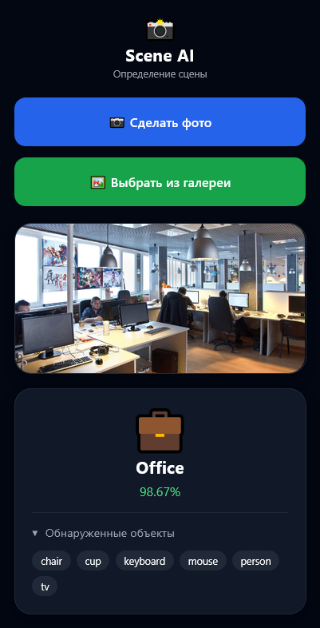

# 📸 Scene AI — определение сцены по изображению

  
  
  

---

## 📌 О проекте

Scene AI — веб-приложение для классификации сцен на изображениях.

Система определяет тип сцены (дом, улица, офис, ресторан, магазин) и показывает объекты, найденные на изображении.

---

## ⚙️ Функциональность

- загрузка изображения с камеры
- загрузка изображения из галереи
- определение сцены на фото
- детекция объектов с помощью YOLOv8
- отображение confidence (уверенности модели)
- вывод списка найденных объектов

---

## 🧠 Как это работает

1. Пользователь загружает изображение  
2. YOLOv8 определяет объекты на изображении  
3. Объекты преобразуются в признаки  
4. Дополнительно используются онтологические признаки:
   - совместное появление объектов
   - иерархия объектов
   - контекстные веса
   - правила сцен  
5. XGBoost определяет итоговую сцену  
6. Результат отображается пользователю  

---

## 🧩 Онтологические признаки

Для повышения точности используются дополнительные признаки:

- совместное появление объектов (co-occurrence)
- группы объектов по смыслу
- контекстные веса объектов
- правила принадлежности к сценам
- ключевые объекты сцены

---

## 🛠️ Технологии

| Компонент | Используется |
|----------|-------------|
| Backend | FastAPI |
| Детекция объектов | YOLOv8 (Ultralytics) |
| Модель классификации | XGBoost |
| Обработка данных | NumPy, Joblib |
| Frontend | HTML, TailwindCSS, JavaScript |

---

## 📁 Структура проекта

- `model/` — модели YOLOv8 и XGBoost  
- `static/` — интерфейс приложения  
- `ontology_utils.py` — извлечение признаков  
- `main.py` — сервер FastAPI  

---

## 🚀 Как работает приложение

1. Загрузка изображения  
2. Детекция объектов (YOLOv8)  
3. Формирование признаков  
4. Классификация сцены (XGBoost)  
5. Отображение результата  

---

## 📊 Пример работы

  

**Результат:**
- сцена: street  
- confidence: 92.4%  
- объекты: car, person, traffic light  

---

## 📽️ Презентация

📎 презентация проекта: `presentation.pdf`

---
